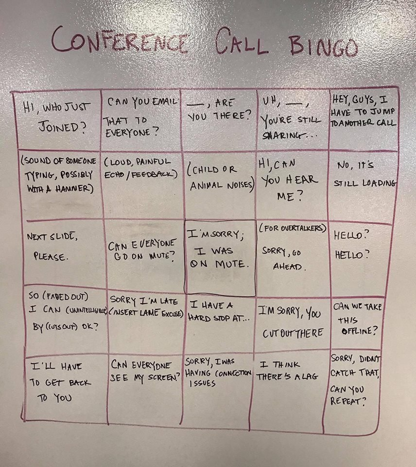

# Conference Call Bingo

This is an app-adaptation of a "popular" bingo-game played in conference calls all over the world.

The idea is that the cliches mentioned on the board happen frequently in conference-calls everywhere. As the clicès start cropping up during the meeting, you tick them off, one by one, until you get a Bingo!

## TODO

* Single-user version with workable bingo board and bingo detection.
* Randomization of the board for more fun!
* Multi-user version where every conference-participant gets a random board and the first one to get a bingo wins!
* Editable cliches-list, making the game adaptable for any scenario
* Sharing of edited lists for community

